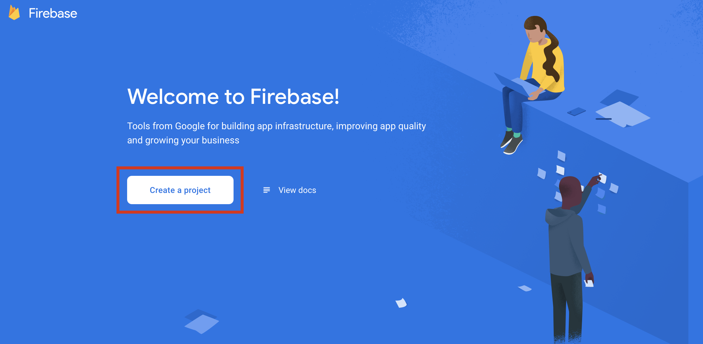
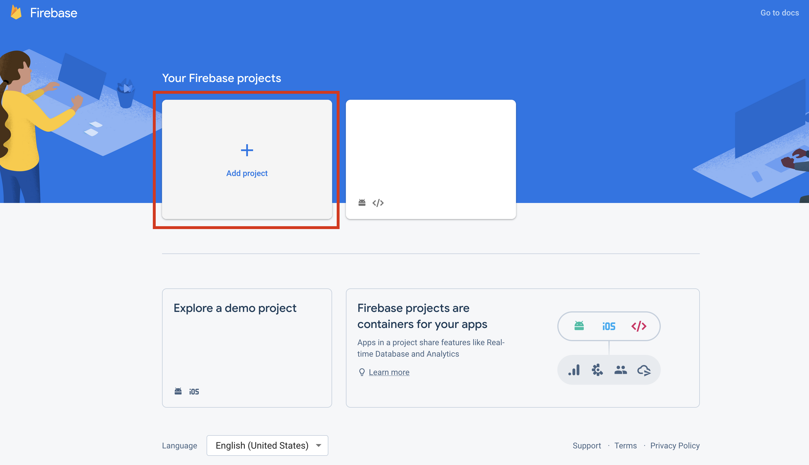
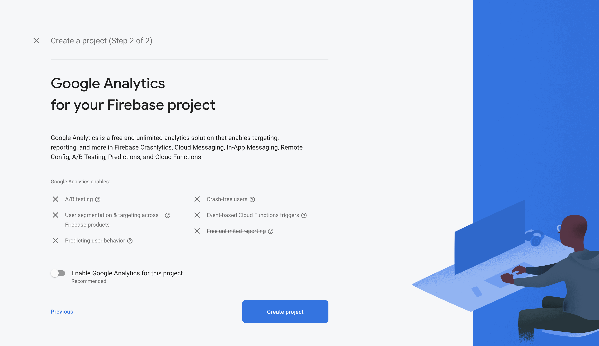
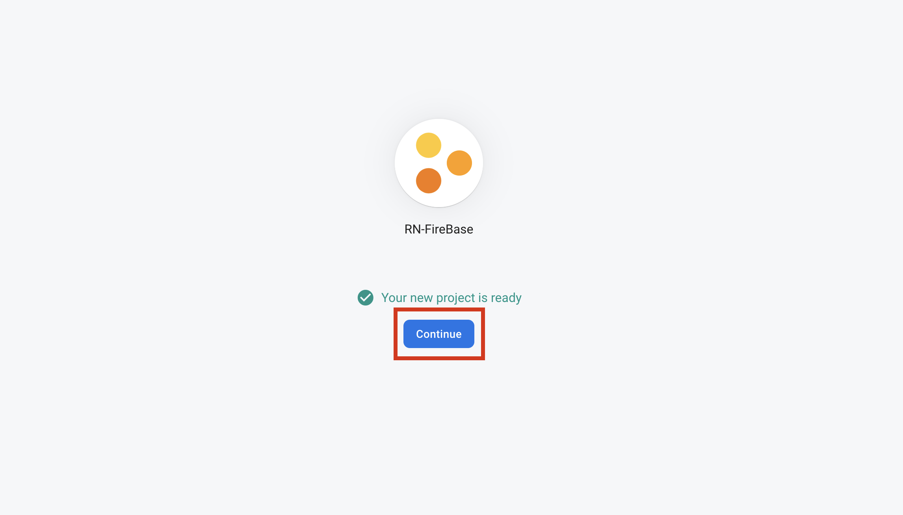
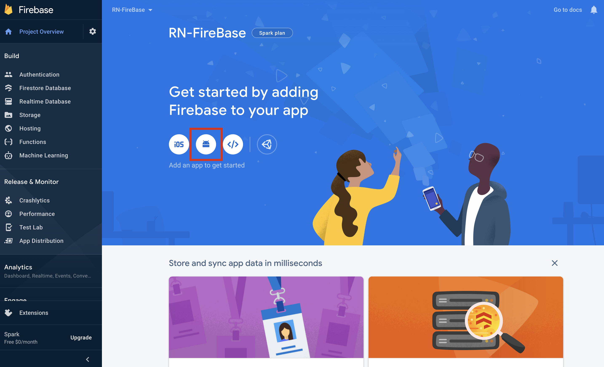
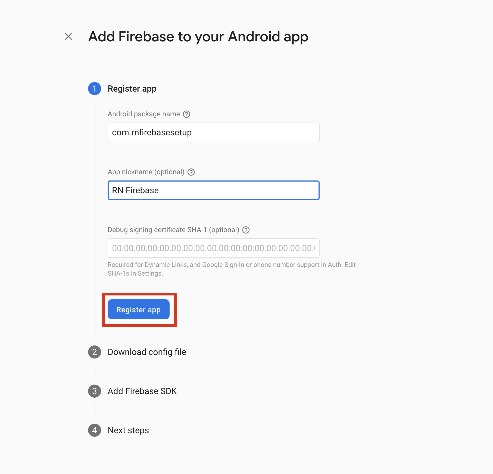
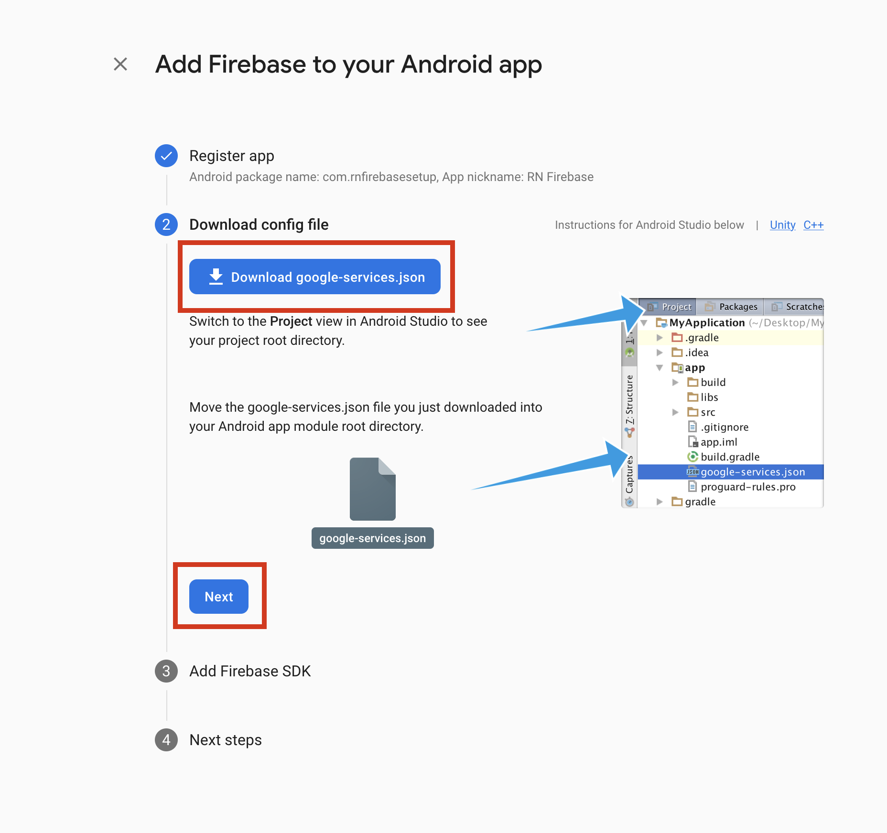
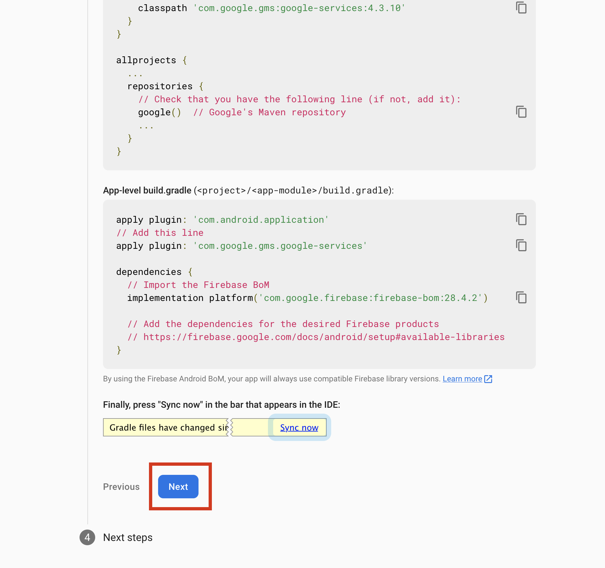
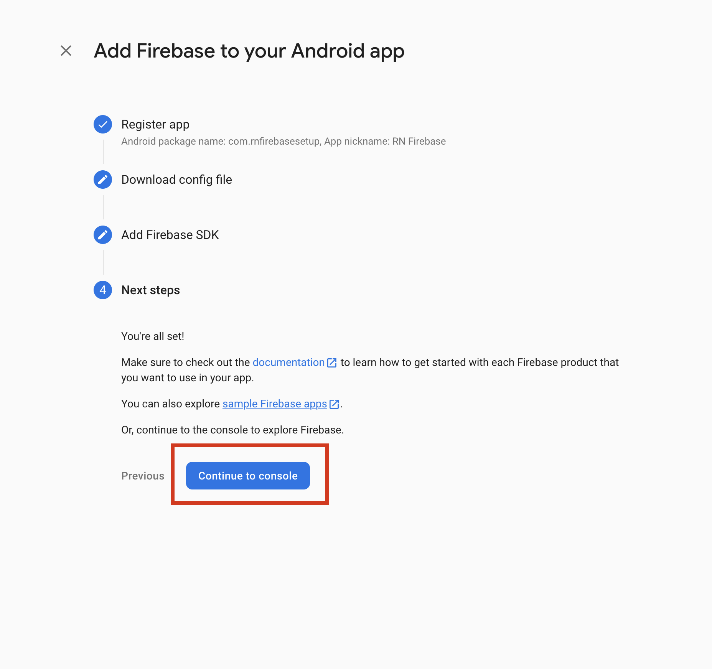

## React Native Firebase Setup

# Installation :

Installing React Native Firebase requires a few steps; installing the NPM module, adding the Firebase config files & rebuilding your application.The @react-native-firebase/app module must be installed before using any other Firebase service.

```
# Using npm
npm install --save @react-native-firebase/app

# Using Yarn
yarn add @react-native-firebase/app
```

# Firebase Console Setup :

- Open [Filebase Console](https://console.firebase.google.com/) and then click Get Started

  

- Then Click Create a Project

  

- If you already created a project then click Add project

  

- Then give a project name

  

- If you don't want firebase analytics then dasibale it and click Create Project

  

- When your projrct is created then click Continue

  

# Android Setup :

To allow the Android app to securely connect to your Firebase project, a configuration file must be downloaded and added to your project.

### Generating Android credentials :

- Open [Filebase Console](https://console.firebase.google.com/) and then click this android icon

  

- Then add your android package name ... you can find it here android/app/src/main/java/MainActivity.java . then app nickname is optional ... after add the package name then click Register app

  

- Then download this google-services.json file and past it android/app/ here ... after adding json file click Next

  

### Configure Firebase with Android credentials :

- Now first, add the google-services plugin as a dependency inside of your /android/build.gradle file:

```
buildscript {
  dependencies {
    // ... other dependencies
    classpath 'com.google.gms:google-services:4.3.10'  // Add this line
  }
}
```

- Lastly, execute the plugin by adding the following to your /android/app/build.gradle file:

```
apply plugin: 'com.android.application'
apply plugin: 'com.google.gms.google-services' // <- Add this line
```



- Now all the step done so click Continue to console


